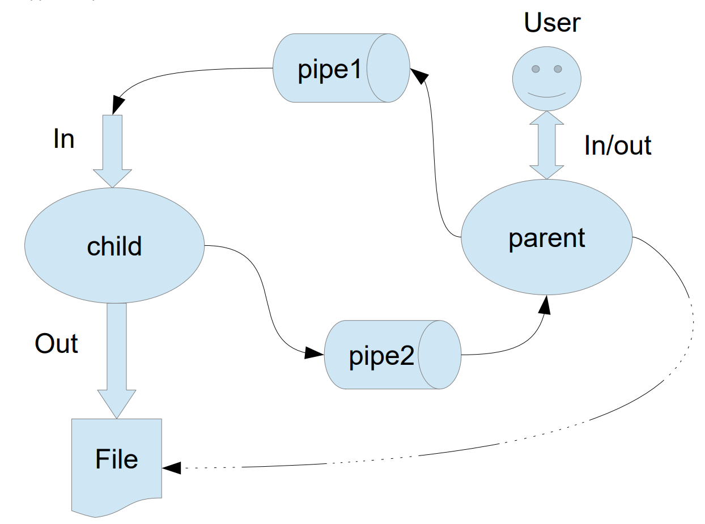

# OS 1 ЛР

## Вариант 17
Родительский процесс создает дочерний процесс. Первой строкой пользователь в консоль \
родительского процесса вводит имя файла, которое будет использовано для открытия File с таким \
именем на запись. Перенаправление стандартных потоков ввода-вывода показано на картинке \
выше. Родительский и дочерний процесс должны быть представлены разными программами. \
Родительский процесс принимает от пользователя строки произвольной длины и пересылает их в \
pipe1. Процесс child проверяет строки на валидность правилу. Если строка соответствует правилу, \
то она выводится в стандартный поток вывода дочернего процесса, иначе в pipe2 выводится \
информация об ошибке. Родительский процесс полученные от child ошибки выводит в \
стандартный поток вывода.

Правило фильтрации: строки длины больше 10 символов отправляются в pipe2, иначе 
в pipe1. Дочерние процессы удаляют все гласные из строк.



## Инструкция по запуску
1. **Склонируйте ветку с лабой и откройте в VS Code**
    ```bash
   git clone -b lr1 https://github.com/mihateren/os.git
   cd os
   code os
    ```
2. **Сборка через Dev Container**
    Установите расширение [Dev Containers](vscode:extension/ms-vscode-remote.remote-containers).
    
3. **Откройте проект в Dev Container**
    Нажмите F1 или Ctrl+Shift+P для открытия палитры команд.
    Введите Dev Containers: Reopen in Container и выберите этот пункт.

4. **Сборка и запуск проекта в контейнере**
    После того как контейнер будет готов, откройте терминал в VS Code и выполните команды:
    ```
    mkdir build
    cd build
    make
    ```
5. **Выполните команды для запуска проекта**
    Для запуска программы введите:
        ```
        ./lr1_exe
        ```\
